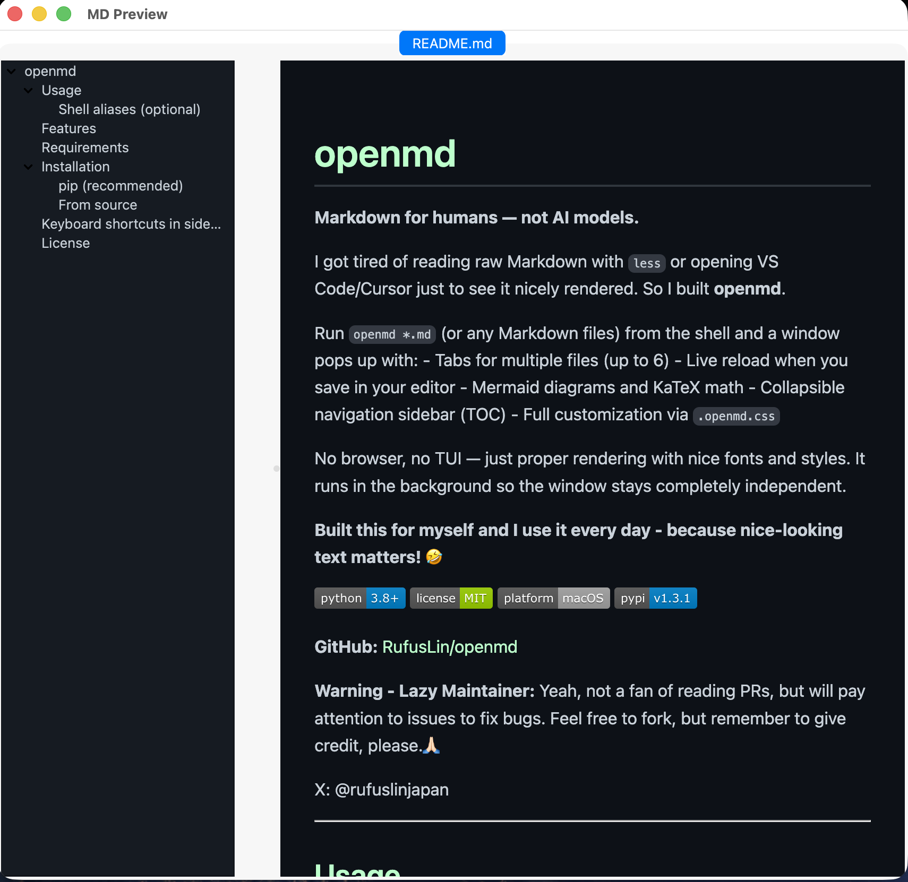
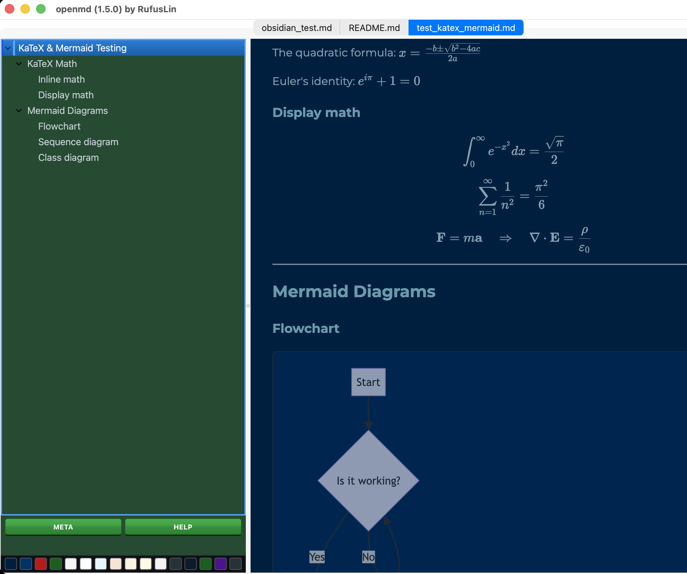

# openmd

**Markdown viewer for humans — not AI models.**

I got tired of reading raw Markdown with `less` or opening VS Code/Cursor just to see it nicely rendered. So I built **openmd**.

Run `openmd *.md` (or any Markdown files) from the shell and a window pops up instantly — the shell prompt returns immediately, no blocking, no `&` needed.

   

**GitHub:** [RufusLin/openmd](https://github.com/RufusLin/openmd)

**Warning - Lazy Maintainer:** Yeah, not a fan of reading PRs, but will pay attention to issues to fix bugs. Feel free to fork, but remember to give credit, please.🙏🏻

X: @rufuslinjapan

---

## What it looks like




*(Click any image to enlarge)*

---

## Usage

```bash
# Open a single file
openmd README.md

# Open multiple files (each in its own tab)
openmd doc1.md doc2.md doc3.md

# No arguments — interactive picker (choose from .md files in current directory)
openmd

# Glob expansion
openmd docs/*.md
```

### Shell function (optional, for quick access)

Add to your `~/.zshrc` or `~/.bashrc`:

```zsh
openmd() { "$HOME/lab/openmd/openmd.py" "$@" 2>&1 }
```

Or if installed via pip, the `openmd` command is already in your `PATH`.

### Remote preview via SSH (optional)

```zsh
remotemd() {
    local remote_path="$1"
    local filename=$(basename "$remote_path")
    local tmp_file="/tmp/remote_preview_${filename}.md"
    scp "home:$remote_path" "$tmp_file" && openmd "$tmp_file"
}
```

---

## Features

- **Instant launch** — the shell prompt returns immediately; openmd runs as a fully detached GUI app (no `&` needed, no blocking)
- **GitHub-dark theme by default** — comfortable reading in low-light environments
- **16 built-in themes** — dark and light, switch instantly via the swatch bar at the bottom of the sidebar; fully customizable via `.openmd.css`
- **Live reload** — the preview updates instantly when the file is saved; no manual refresh needed
- **Mermaid diagrams** — fenced ` ```mermaid ` blocks render automatically via CDN
- **KaTeX math** — inline `$…$` and display `$$…$$` expressions render out of the box
- **Collapsible sidebar TOC** — hierarchical (H1 → H2 → H3); click or press Return to jump to any heading
- **Multi-file tabs** — pass multiple `.md` files (even `*.md` globs) and each opens in its own tab, max 6
- **Interactive file picker** — run with no arguments and choose from `.md` files in the current directory via a curses-based picker
- **Remote image caching** — remote images in your Markdown are downloaded to a local temp cache so they render correctly in the Qt WebEngine view
- **External link handling** — clicking any `http`/`https` link opens it in your default browser; the preview window never navigates away
- **Update notifications** — on startup, openmd quietly checks PyPI (at most once every 6 hours) and shows a non-intrusive popup if a newer version is available
- **Version in title bar** — the window title shows the running version for quick reference
- **Keyboard shortcuts** — `Esc` closes the window; arrow keys and Return navigate the sidebar

---

## Theming with `.openmd.css`

openmd ships with 16 built-in themes (8 dark, 8 light) selectable from the swatch bar. To customize further, create a `.openmd.css` file — it is appended after the built-in CSS so any rule you write overrides the default via normal CSS cascade.

**Lookup order** (first match wins):

| Priority | Location |
|----------|----------|
| 1 | Current working directory (`./`) |
| 2 | openmd install directory |
| 3 | Home directory (`~/`) |

To switch themes programmatically, add `body.theme-yourname { ... }` blocks to your `.openmd.css`. The swatch bar automatically discovers and displays any themes defined there.

---

## Requirements

- macOS or Linux (POSIX)
- Python 3.8+
- [PySide6](https://pypi.org/project/PySide6/) + PySide6-WebEngine
- [Markdown](https://pypi.org/project/Markdown/)
- [BeautifulSoup4](https://pypi.org/project/beautifulsoup4/)

**Note:** Mermaid and KaTeX require an internet connection to load from CDN.

---

## Installation

### pip (recommended)

```bash
pip install openmd
```

After installing, the `openmd` command is available in your shell.

### From source

```bash
git clone https://github.com/RufusLin/openmd.git
cd openmd
pip install -e .
```

---

## Keyboard shortcuts

| Key | Action |
|-----|--------|
| `Esc` | Close the preview window |
| `↑` / `↓` | Navigate the sidebar TOC |
| `Return` | Jump to selected heading |

---

## License

MIT
