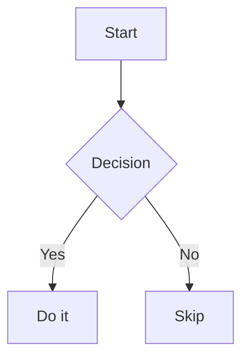

# openmd

A fast, minimal Markdown previewer for macOS with a GitHub-dark theme, collapsible sidebar TOC, live reload, Mermaid diagrams, KaTeX math, and multi-file tab support.
Built this for myself because who needs to fire up VS Code or Cursor just to quickly view a pretty printed Markdown file, right?🤣

   

**GitHub:** [RufusLin/openmd](https://github.com/RufusLin/openmd)
**Warning - Lazy Maintainer:** Really bad at reading PRs, but will pay attention to issues to fix bugs. Feel free to fork, remember to give credit, please.

---

## Usage

```bash
# Open a single file
openmd README.md

# Open multiple files (each in its own tab)
openmd doc1.md doc2.md doc3.md

# No arguments — interactive picker (choose from .md files in current directory)
openmd

# Glob expansion
openmd docs/*.md
```

### Shell aliases (optional)

Add to your `~/.zshrc` or `~/.bashrc` for quick access:

```zsh
# Local preview — opens in background
localmd() {
    openmd "$@" >/dev/null 2>&1 &
}

# Remote preview via SSH (requires a 'home' SSH alias in ~/.ssh/config)
remotemd() {
    local remote_path="$1"
    local filename=$(basename "$remote_path")
    local tmp_file="/tmp/remote_preview_${filename}.md"
    scp "home:$remote_path" "$tmp_file" && \
    openmd "$tmp_file" >/dev/null 2>&1 &
}
```

---

## Features

- **GitHub-dark theme** — comfortable reading in low-light environments. BUT! Change it to whatever you like in `.openmd.css`
- **Live reload** — the preview updates instantly when the file is saved; no manual refresh needed
- **Mermaid diagrams** — fenced ` ```mermaid ` blocks render automatically via CDN
- **KaTeX math** — Formulae? inline `$…$` and display `$$…$$` expressions render out of the box
- **Collapsible sidebar TOC** — hierarchical, of course; click any heading to jump to it
- **Multi-file tabs** — pass multiple `.md` files (even `*.md` globs) and each opens in its own tab, max 6
- **Interactive file picker** — run with no arguments and choose from `.md` files in the current directory via a curses-based picker — no need to copy and paste file names
- **Remote preview** — optional `remotemd` shell alias pulls a file from a remote host via `scp` and opens it instantly
- **Keyboard shortcuts** — `Esc` closes the window; arrow keys navigate the sidebar

---

## Requirements

- macOS (uses PySide6/Qt WebEngine)
- Python 3.8+
- [PySide6](https://pypi.org/project/PySide6/)
- [Markdown](https://pypi.org/project/Markdown/)
- [BeautifulSoup4](https://pypi.org/project/beautifulsoup4/)

---

## Installation

### pip (recommended)

```bash
pip install openmd
```

After installing, the `openmd` command is available in your shell.

### From source

```bash
git clone https://github.com/RufusLin/openmd.git
cd openmd
pip install -e .
```

---

## Live reload

Openmd watches the opened file for changes using Qt's `QFileSystemWatcher`. Save the file in any editor (vim, neovim, VS Code, etc.) and the preview — including the sidebar TOC — updates instantly with no manual refresh.

## Mermaid & KaTeX

Mermaid and KaTeX are loaded automatically from CDN on every render. No configuration required.

**Mermaid example:**
````markdown

````

**KaTeX example:**
```markdown
Inline: $E = mc^2$

Display:
$$\int_0^\infty e^{-x^2} dx = \frac{\sqrt{\pi}}{2}$$
```

> **Note:** Mermaid and KaTeX require an internet connection to load from CDN. Offline rendering is not currently supported (maybe never, come to think of it😉).

---

## Keyboard shortcuts

| Key | Action |
|-----|--------|
| `Esc` | Close the preview window |
| `↑` / `↓` | Navigate the sidebar TOC |
| Click heading | Jump to that section |

---

## License

MIT
