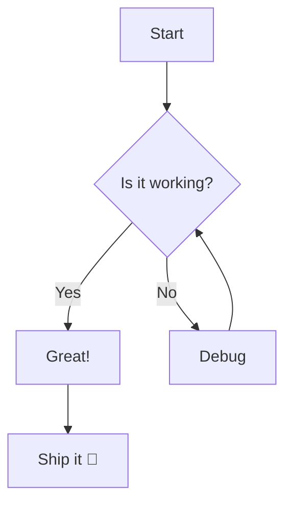
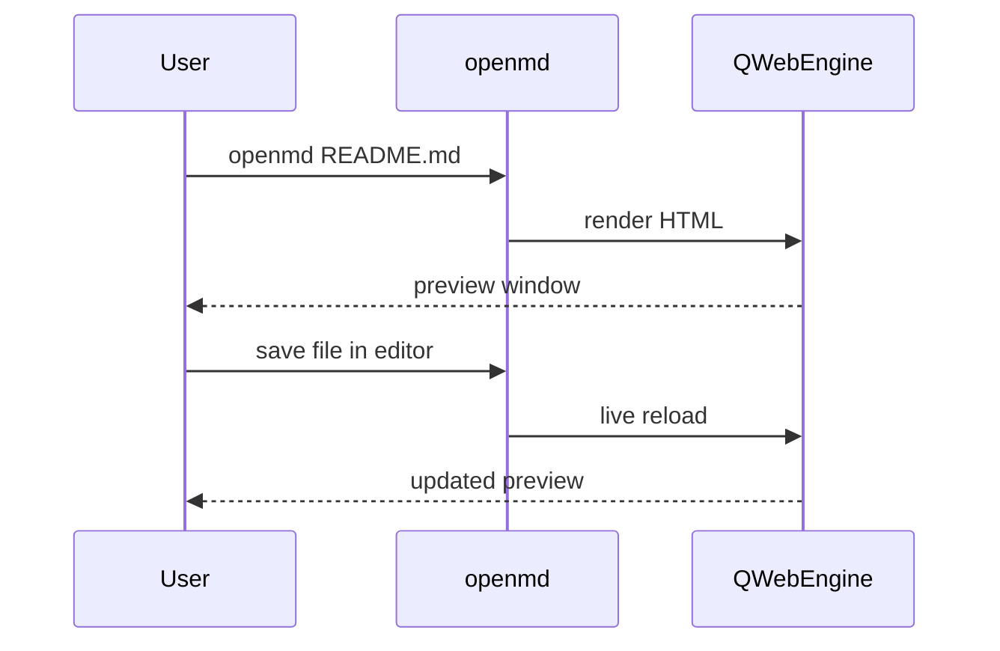
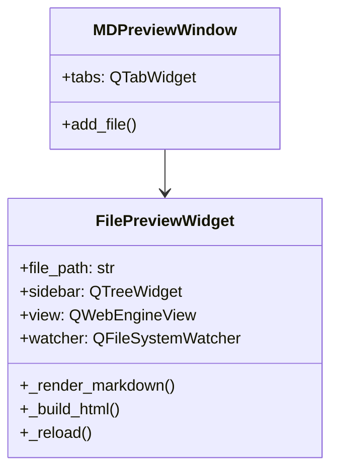

# KaTeX & Mermaid Testing

## KaTeX Math

### Inline math

Einstein's famous equation: $E = mc^2$

The quadratic formula: $x = \frac{-b \pm \sqrt{b^2 - 4ac}}{2a}$

Euler's identity: $e^{i\pi} + 1 = 0$

### Display math

$$\int_0^\infty e^{-x^2} dx = \frac{\sqrt{\pi}}{2}$$

$$\sum_{n=1}^{\infty} \frac{1}{n^2} = \frac{\pi^2}{6}$$

$$\mathbf{F} = m\mathbf{a} \quad \Rightarrow \quad \nabla \cdot \mathbf{E} = \frac{\rho}{\varepsilon_0}$$

---

## Mermaid Diagrams

### Flowchart

### Sequence diagram

### Class diagram

